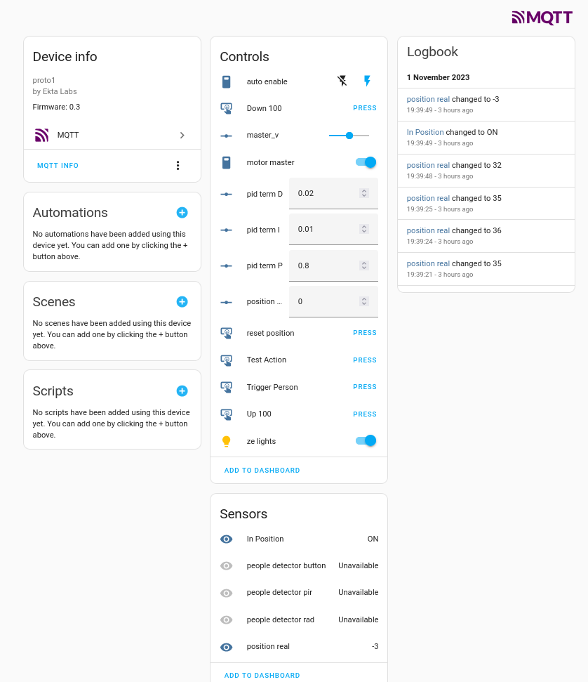

## What?
This is the firmware for a halloween installation.

The general concept is:
* some pixel leds forming an animated frame around a door.
* motion sensors to detect trick-or-treaters approaching the door
* A spider on a string, motorized to jump up and scare guests. 
* Connected to Home Assistant for monitoring and debug control

[](pics/spider-dark-2023.mp4 "Video of basic operation...")

It's all done in micropython, on an ESP32, because that was something I wanted to try out a bit more.

## Status
The sensors tested, a cheap HC-SR505 PIR sensor and a cheap RCWL0516 "radar" turned out to be worthless outdoors.  Oh well.  I hooked up both a physical button, and a home assistant action to be able to trigger the animation effect by hand.  That worked well enough to scare people, and have some fun, so we'll call it a success. Both of these worked well enough indoors at shorter distances, in testing...

The animation sequence and motor motion control would occasionally lose it's mind.  I suspect improper handling of asyncio somewhere, but ... I never had a console on it long enough when it was problematic.  Good enough for the oneoff it was, but definitely room for improvement.

## Hardware
* The ESP32 board is a [Lilygo T-Display](https://www.lilygo.cc/products/lilygo%C2%AE-ttgo-t-display-1-14-inch-lcd-esp32-control-board)
* The Motor is a [JGA25-370 geared DC motor](https://www.aliexpress.com/item/1005003027339568.html). I used a 12V, ~600 RPM, and used a RC car wheel as the spool for my string.
* The motor drivers were the first cheap H-bridge I picked up that could do 12V. Specifically, I used [a TA6586 module](https://www.aliexpress.com/item/4001144312530.html) because the screw terminals and mounting hole made it easy to bodge up.
* The pixel strip is a 5M WS2815 strip, waterproof.  I ran it with only 3.3v signalling, which I believe is the cause of the occasional glitches in colour.  Obviously 5V drive would have been preferrable.


## TODO
* find some damn sensors that have more range! asdfkadslfkds!!")(#)"#$!
* more status updates over mqtt
* more status updates on the screen

## More pics


[](pics/daylight-spider.mp4)




## Getting Started
```
. /esp/somewhere/export.sh
git submodule update --init
make -C lib/micropython/ports/esp32 submodules
cd boards/CUSTOM_ESP32
idf.py build
....
profit
```
aka
```
podman run --rm --device /dev/ttyUSB1 -v .:/project -w /project/boards/CUSTOM_ESP32 -e HOME=/tmp espressif/idf:v5.0.4 idf.py -b 921660 build erase-flash flash
```


## Upstream
This repository structure is based on: https://github.com/micropython/micropython-example-boards

## Extra notes
We're using an unmerged PR, to get support for the hardware encoder support on the ESP32.  Without it, you'll never get viable encoder positions from a turning motor.  The `encoder_portable.py` implementation I used initially is only really suited for UI dials.  This should still "land soon"

We built and tested prometheus-aio because at one stage we were going to record all the "scarings" for fun reporting.  But it ne ver really felt very performant, and it was _very_ out of scope :)

We modified the neopixel built in code to be able to use slices.  This was inspired by the `blaz_neopixel` project, which targets rp2040.

Working in HSV means even numkins like myself can do colour animations!
